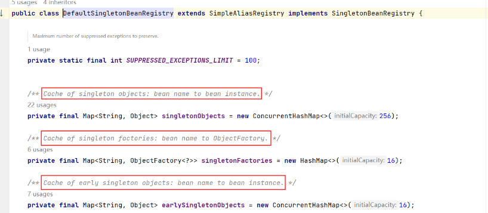
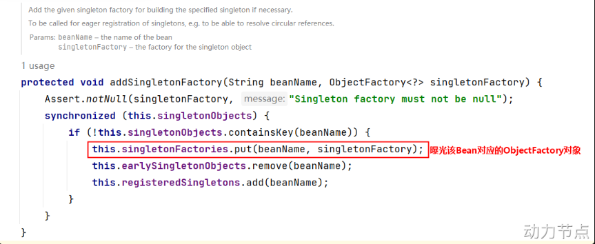
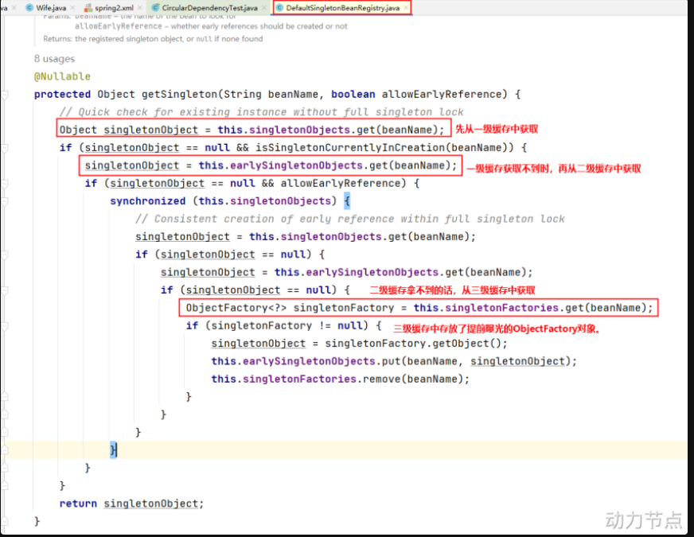

Spring为什么可以解决set + singleton模式下循环依赖？   
根本的原因在于：这种方式可以做到将“实例化Bean”和“给Bean属性赋值”这两个动作分开去完成。   
实例化Bean的时候：调用无参数构造方法来完成。**此时可以先不给属性赋值，可以提前将该Bean对象“曝光”给外界**。   
给Bean属性赋值的时候：调用setter方法来完成。  
两个步骤是完全可以分离开去完成的，并且这两步不要求在同一个时间点上完成。
也就是说，Bean都是单例的，我们可以先把所有的单例Bean实例化出来，放到一个集合当中（我们可以称之为缓存），所有的单例Bean全部实例化完成之后，以后我们再慢慢的调用setter方法给属性赋值。这样就解决了循环依赖的问题。
那么在Spring框架底层源码级别上是如何实现的呢？请看：

我们再来看，在该类中有这样一个方法addSingletonFactory()，这个方法的作用是：将创建Bean对象的ObjectFactory对象提前曝光。

再分析下面的源码：

从源码中可以看到，spring会先从一级缓存中获取Bean，如果获取不到，则从二级缓存中获取Bean，如果二级缓存还是获取不到，则从三级缓存中获取之前曝光的ObjectFactory对象，通过ObjectFactory对象获取Bean实例，这样就解决了循环依赖的问题。  

总结： Spring只能解决setter方法注入的单例bean之间的循环依赖。ClassA依赖ClassB，ClassB又依赖ClassA，形成依赖闭环。Spring在创建ClassA对象后，不需要等给属性赋值，直接将其曝光到bean缓存当中。在解析ClassA的属性时，又发现依赖于ClassB，再次去获取ClassB，当解析ClassB的属性时，又发现需要ClassA的属性，但此时的ClassA已经被提前曝光加入了正在创建的bean的缓存中，则无需创建新的的ClassA的实例，直接从缓存中获取即可。从而解决循环依赖问题。